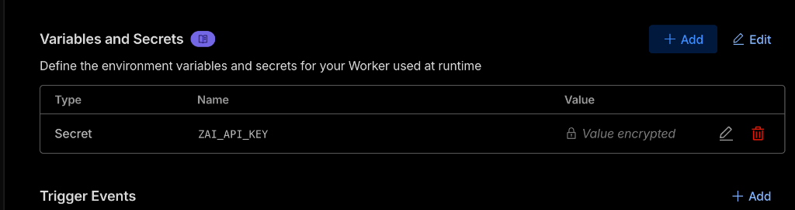

# Z.AI OpenAI Proxy Worker - Walkthrough

## What Was Built

A Cloudflare Worker that proxies OpenAI-compatible API requests to Z.AI, making it easy to use Z.AI's GLM 4.7 model with any OpenAI SDK client.

## Deployed Resources

| Resource | URL |
|----------|-----|
| **Worker** | [zai-openai-proxy.vallangirakesh.workers.dev](https://zai-openai-proxy.vallangirakesh.workers.dev) |
| **GitHub** | [github.com/Rakesh-207/zai-openai-proxy](https://github.com/Rakesh-207/zai-openai-proxy) |

## Research Findings

| Item | Details |
|------|---------|
| Z.AI API Base URL | `https://api.z.ai/api/coding/paas/v4/` (Coding Plan Endpoint) |
| Default Model | GLM 4.7 (released Dec 2025) |
| Special Features | **Thinking Enabled by Default** |
| Lite Plan Rate Limit | ~120 prompts per 5 hours |
| Plan Cost | $3/month first cycle, then $6/month |

## Verification Results

````carousel
### Health Check
```json
{
  "status": "ok",
  "service": "Z.AI OpenAI Proxy",
  "default_model": "glm-4.7",
  "rate_limit_info": "~120 prompts per 5 hours (Lite Coding Plan)"
}
```
<!-- slide -->
### Models Endpoint
```json
{
  "object": "list",
  "data": [
    {"id": "glm-4.7", "owned_by": "zhipu"},
    {"id": "glm-4.6", "owned_by": "zhipu"},
    {"id": "glm-4.5", "owned_by": "zhipu"},
    {"id": "glm-4.5-air", "owned_by": "zhipu"}
  ]
}
```
````

## Configuration Verification

The `ZAI_API_KEY` secret has been successfully configured in the Cloudflare Dashboard:



## Next Steps

> [!SUCCESS]
> The Z.AI API Key is configured. You are ready to make requests!

### Usage Example (Python)

```python
from openai import OpenAI

client = OpenAI(
    api_key="any-value",  # Not used, but required by SDK
    base_url="https://zai-openai-proxy.vallangirakesh.workers.dev/v1"
)

response = client.chat.completions.create(
    messages=[{"role": "user", "content": "Hello!"}]
)
print(response.choices[0].message.content)
```
